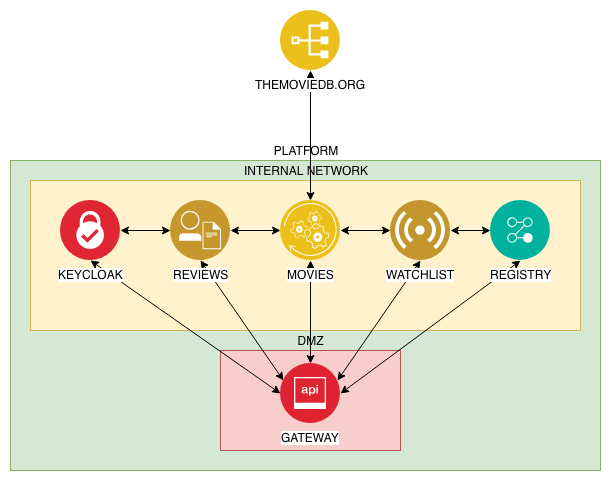

# Microservices Weekend

## Reference Architecture

## General Setup

Clone this repository and open the entire directory in IntelliJ.
Add all the subprojects as Maven projects.

Start up all the services, starting with the `config-service`.
Once it is rnning, start up the `registry-service`.

Once both of them are running correctly, you can start the other services.

## Components

### Admin Service

Runs the new and improved version of the Spring Boot Admin Server.
It runs on port `8083` and you can browse it on http://localhost:8083].

### Config Server

Serves the configuration of the services and runs on its default 8888` port.
It is backed by a local git repository.

### Hystrix Dashboard

This is a small Spring Boot application that can monitor the Hystrix stream endpoints of your services.
It runs on port `8082` and you can browse it on http://localhost:8082/hystrix].
If you want to monitor the Hystrix stream of the Movie Service, you need to enter its URL in the input field, for example:
[http://localhost:8080/actuator/hystrix.stream].

### Movie Service

Combines movie information from [The Movie DB](https://www.themoviedb.org) with our own recommendations.
It fetches both pieces of information in parallel and combines them to serve a single view on a movie.
It runs on port `8080` and you can browse it on [http://localhost:8080/movie/{movieId}].

### Recommendation Service

Holds movie recommendations.
All the queries are based on the movie ID from The Movie DB, for example `tt3778644`.
It runs on port `8081` and you can browse it on [http://localhost:8081/recommendations/{movieId}].

### Registry Service

Holds the service registry where applications will register themselves at startup.
It runs on the default port `8761`.